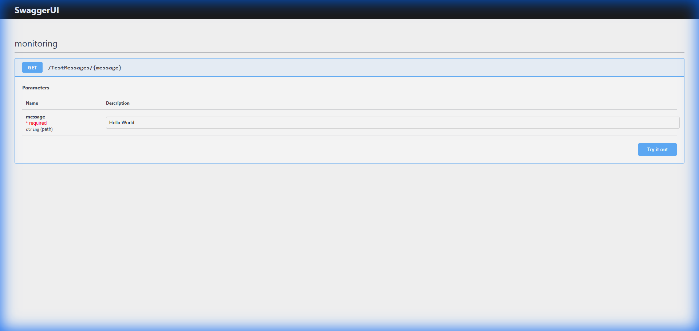
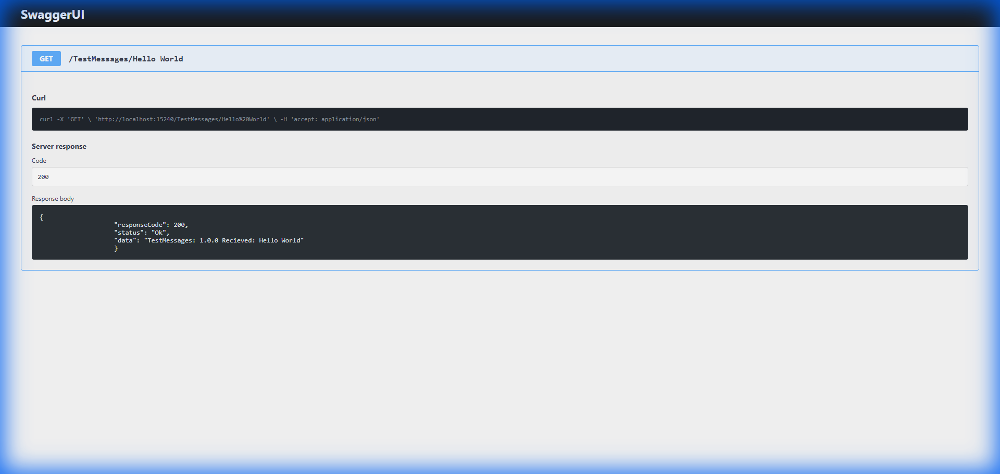

# DSMongoDBApi V2.0 (Modern)

This is the documentation for the **Generic MongoDB Data Proxy V2.0**, now running on **Fastify** and featuring a dynamic query engine and RBAC (Role-Based Access Control).

## Test Examples

- To test it, simply run `npm run dev` (development) or `npm start` (production). When done, you will receive a log similar to this:
   ```javascript
   [15:30:45.123] INFO (11552): Server listening on http://0.0.0.0:15240
   [15:30:45.124] INFO (11552): Swagger documentation available at http://localhost:15240/docs
   ```

## Run in local
 - Open your terminal.
 - Navigate to the project root folder.
 - Install dependencies (if not done yet): `npm install`
 - Run in development mode: `npm run dev`
 - Access the API at `http://localhost:15240`

## Run in docker
 - Build the image from the root folder:
   ```bash
   npm run build
   docker build -t generic-mongodb-proxy .
   ```
 - Run the container:
   ```bash
   docker run -d --name dsmongodb -p 15240:15240 generic-mongodb-proxy
   ```
   *Note: Ensure your MongoDB instance is accessible. Within Docker, you might need to use `host.docker.internal` for local MongoDB.*

### Testing in a browser
    




#### Call Result


### Testing in Postman / API Client

- **HealthCheck**
  ```javascript
  GET http://localhost:15240/Health
  ```
  - Sample Response:
  ```javascript
  {
    "responseCode": 200,
    "status": "Ok",
    "data": {
        "api": {
            "apiName": "dsMongoDBApi",
            "apiVersion": "2.0.0",
            "apiSupportedVersions": ["1.0.0"],
            "apiHost": "localhost",
            "apiPort": "15240",
            "apiDescription": "Demonstrating how to describe a RESTful API with Fastify, MongoDb, Swagger and Pino logs"
        },
        "databases": [
            { "connectionName": "Primary", "databaseName": "Curiosity", "url": "mongodb://localhost:27017", "status": "Ok" },
            { "connectionName": "Primary", "databaseName": "admin", "url": "mongodb://localhost:27017", "status": "Ok" }
        ]
    }
  }
  ```

- **Echo Test Message**
  ```javascript
  GET http://localhost:15240/TestMessages/Hello World
  ```
  - Response:
  ```javascript
  {
    "responseCode": 200,
    "status": "Ok",
    "data": "TestMessages: 1.0.0 Recieved: Hello World"
  }
  ```

## Documents CRUD operations (Dynamic Queries)

The V2.0 API supports dynamic routing where the `database` and `collection` are passed as query parameters.

### 1. Get Documents
Select **GET** and enter:
```javascript
http://localhost:15240/Documents?database=test&collection=testCollection&filter={"name":"My name"}&selectedFields={"name":1,"address":1}
```
*   **database**: Target MongoDB database.
*   **collection**: Target collection.
*   **filter**: (Optional) MongoDB JSON filter.
*   **selectedFields**: (Optional) JSON projection (e.g., `{"name":1}`).

### 2. Put (Create) Document
Select **PUT** and enter:
```javascript
http://localhost:15240/Documents?database=test&collection=testCollection
```
Body (JSON):
```javascript
{
  "name": "New Entry",
  "address": "Street 123"
}
```

### 3. Patch (Update) Documents
Select **PATCH** and enter:
```javascript
http://localhost:15240/Documents?database=test&collection=testCollection&filter={"name":"New Entry"}
```
Body (JSON update):
```javascript
{
  "address": "Updated Street 456"
}
```

### 4. Delete Documents
Select **DELETE** and enter:
```javascript
http://localhost:15240/Documents?database=test&collection=testCollection&filter={"name":"New Entry"}
```

## Security (RBAC)
The API uses Role-Based Access Control. Ensure you include the necessary headers:
- `client-authorization`: Application ID/Name.
- `client-authentication`: Token or Secret (depending on environment config).
- `accept-version`: `1.0.0` (for compatibility).

*Example Headers:*
```http
client-authorization: MyWebApp
client-authentication: app-secret-key
accept-version: 1.0.0
```


## Use the API from code 

### Angular Typescript Example (V2.0 Compatible)
```typescript
import { HttpClient, HttpHeaders, HttpParams } from '@angular/common/http';

export class HttpclientService {
  constructor(private http: HttpClient) {}

  public async getData<T>(database: string, collection: string, filter: string): Promise<T> {
    const url = `http://localhost:15240/Documents`;
    const params = new HttpParams()
      .set('database', database)
      .set('collection', collection)
      .set('filter', filter);

    const headers = new HttpHeaders()
      .set('client-authorization', 'MyAngularApp')
      .set('accept-version', '1.0.0');

    return this.http.get<T>(url, { headers, params }).toPromise();
  }
}
```

### Author
**José Durán Pareja**
* [github/jodurpar](https://github.com/jodurpar)

### License
Copyright © 2020-2026 [José Durán Pareja](https://github.com/jodurpar).
Released under the [MIT License](./mitLicense.md).


